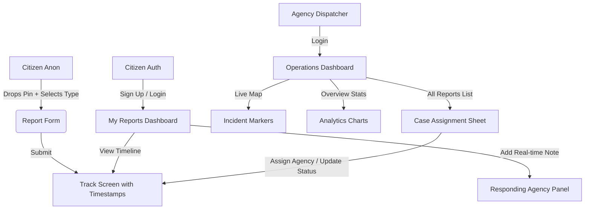

# PRODUCT REQUIREMENT DOCUMENT (PRD)

## Project: IRMS (Incident Response Management System)
**Document Version:** 1.0.0  
**Target Deployment:** Redemption Camp & Ogun State Emergency Services Pilot (Lagos-Ibadan Expressway, Nigeria)  
**Status:** Approved for Implementation  
**Primary Stack:** Next.js (App Router), TailwindCSS, shadcn/ui, MongoDB / PostgreSQL, Express/Node.js, Leaflet/Mapbox, WebSockets  

---

## 1. Executive Summary & Project Vision

### 1.1 Problem Statement
During large-scale conventions and daily operations along the Lagos-Ibadan Expressway corridor (specifically Redemption Camp), emergency dispatch is severely hindered by:
- **Inefficient Communication:** High reliance on phone hotlines leading to busy lines, dropped calls, and miscommunicated landmarks.
- **Lack of Geo-Location Precision:** Responders struggle to locate specific halls, gates, or expressway kilometers without GPS pins.
- **Zero Transparency:** Citizens filing reports are left in the dark regarding status, leading to double-reporting or panic.
- **Siloed Responders:** Medical, traffic (FRSC), fire, and camp security operate on independent systems with zero cross-agency routing or collaboration.

### 1.2 Vision & Solution
IRMS is a civic emergency coordination platform that allows citizens to report incidents within a 30-second window, geo-locates the distress precisely on an interactive map, and dynamically routes the report to verified agencies (e.g., Nigeria Police, Federal Road Safety Corps, RCCG Camp Security, and medical units) based on their declared geo-fenced service radius.

---

## 2. Product Personas & User Flows



### 2.1 Citizen Persona (Anonymous & Authenticated)
- **Anonymous Citizen:** Needs to file a report instantly without friction, registration, or logging in. Receives a tracking reference (e.g., `INC-2026-00149`) tied to their browser session.
- **Authenticated Citizen:** Can register and sign in to view a history of all reports they've filed. They receive push/SMS notifications when status changes and can add real-time notes/updates to active incidents.

### 2.2 Responding Agency Persona (e.g., Adebayo Olamide - Dispatch Lead)
- **Agency Dispatcher:** Operates a modern, clean command-center view. Monitors incoming incidents within their service radius (e.g., 25 km from the camp coordinates).
- **Workflows:**
  - **Review Queue:** Receives instant sounds/alerts for new "Received" incidents.
  - **Triage & Assignment:** Reviews descriptions and images, then marks cases "Under Review" or assigns them to a field team (e.g., "RCCG Camp Security", "FRSC Mile 46").
  - **Resolution Lifecycle:** Manages status transitions: `Received` $\rightarrow$ `Under Review` $\rightarrow$ `Assigned` $\rightarrow$ `Resolved`.

---

## 3. Core Feature Requirements

### 3.1 Mapping & Geo-Location System
- **Citizen Pin Placement:** An interactive map (Leaflet/Mapbox GL) centering on Redemption Camp (`6.8932° N, 3.1721° E`). GPS auto-detection automatically places the marker at the citizen's current coordinates.
- **Map Overlays:** Dispatchers see active, colored incident markers reflecting live status:
  - <span style="color:#C8463C">●</span> **Received:** Red pulsing marker (Unassigned).
  - <span style="color:#B97A2A">●</span> **Under Review:** Amber marker.
  - <span style="color:#3B6FB8">●</span> **Assigned:** Blue marker.
  - <span style="color:#3E8657">●</span> **Resolved:** Green marker.

### 3.2 Dynamic Routing & Geo-Fenced Service Areas
- Responding agencies declare a **Service Coverage Radius** (via slider: 5 km to 100 km).
- When a citizen files a report, the backend matches the coordinate against the active radii of agencies. Only eligible agencies see the incident in their operations dashboard, preventing cross-country spam.

### 3.3 Incident Lifecycle & Stepper Tracking
- **TIMELINE STATE MACHINE:** The database enforces a strictly sequential lifecycle state:
  1. `received` (Pulsing trigger, unassigned)
  2. `review` (Under assessment)
  3. `assigned` (Routed to a responder field team)
  4. `resolved` (Case closed with notes)
- **Steppers:** Both citizen tracking pages and agency detail drawers must show the canonical 4-step progress stepper with accurate timeline dates and times (e.g., `14:32 · 27 May`).

### 3.4 Operations Analytics & Dashboards
- **Stat Strip:** Real-time updates of Total, Open, Assigned, and Resolved incidents with daily comparative deltas.
- **Categorized Bar Charts:** Visualizing active vs. resolved incidents across the 6 major categories:
  - Road Traffic Accident (Traffic)
  - Missing Person (Missing)
  - Civil Disturbance (Civil)
  - Medical Emergency (Medical)
  - Flood Incident (Flood)
  - Fire Outbreak (Fire)
- **Performance Chart:** A smooth Bezier sparkline showing average response times over the week (with the target goal of keeping it under 4 minutes).

---

## 4. Enhanced Architecture & Production Tech Stack

To translate the HTML prototype into a production MERN/Next.js system, we will employ a clean, modular structure.

### 4.1 Technology Decisions
- **Frontend Framework:** Next.js 15 (App Router) for hybrid static/dynamic generation, SEO optimizations, and robust API endpoints (Server Actions).
- **Component System:** Radix UI primitives styled with TailwindCSS via `shadcn/ui` to guarantee professional, accessibility-compliant components (sheets, dialogs, dropdowns).
- **Backend/API:** Node.js with Express (or Next.js Serverless Routes) providing robust middleware, token-based JWT authentication, and request rate-limiting.
- **Real-Time Layer:** WebSockets (via Socket.io or Pusher) for instant, low-latency dispatcher dashboard updates when a citizen files a report.
- **Database:** PostgreSQL with Prisma ORM for structured relational schema modeling (Incident, User, RespondingAgency, ActivityLog), or MongoDB for horizontal scale.
- **Mapping Engine:** Mapbox GL JS (via React Map GL) or optimized Leaflet tiles integrated with a reverse-geocoder API to resolve coordinates to landmarks (e.g., "Auditorium 3", "Camp Gate 2").

### 4.2 Technical Folder Architecture
```
/
├── app/                      # Next.js App Router
│   ├── (auth)/               # Citizens & Agency login/signup routes
│   │   ├── login/page.tsx
│   │   └── register/page.tsx
│   ├── (citizen)/            # Public & Citizen pages
│   │   ├── report/page.tsx   # Interactive mapping and submission sheet
│   │   ├── track/[id]/page.tsx # Anonymous and authenticated tracking
│   │   └── dashboard/page.tsx # Citizen reports list
│   ├── (agency)/             # Agency Dispatch pages
│   │   ├── overview/page.tsx # Analytics and overview stats
│   │   ├── map/page.tsx      # Dispatch live map
│   │   └── reports/page.tsx  # All incidents list and detail drawers
│   ├── api/                  # REST and WebSocket endpoints
│   ├── layout.tsx            # Global layout with shadcn ThemeProvider
│   └── globals.css           # Core styling and CSS theme variables
├── components/               # Shared Next.js / shadcn UI components
│   ├── ui/                   # Buttons, inputs, dialogs, drawers, badges
│   ├── map-container.tsx     # Unified Mapbox/Leaflet wrapper
│   └── status-stepper.tsx    # Canonical incident tracker component
├── prisma/
│   └── schema.prisma         # Database schema mapping
└── server/                   # WebSocket & Real-time Express service
```

---

## 5. Advanced & AI-Enabled Capabilities (Production Add-ons)

To transform this system into a world-class platform, we specify the following high-value production enhancements:

### 5.1 Offline-First Local Triage Queue (Service Workers)
- **Problem:** Cellular networks along the Lagos-Ibadan Expressway are notoriously unstable.
- **Solution:** Implement a local browser Service Worker combined with IndexedDB. If a citizen attempts to submit a report during a network cutout:
  1. The report is queued locally on the device.
  2. A visual warning shows: *"Network unstable. Report queued; it will upload automatically when connection returns."*
  3. The system background-syncs and uploads the coordinate and description immediately upon re-establishing a data connection.

### 5.2 AI-Assisted Incident Classification & Triage
- **Feature:** Leverage small LLM integration (e.g., Gemini Flash via backend serverless action) to parse the free-form text input of a report.
- **Functionality:** 
  - If a user inputs: *"Two cars crashed opposite gate 2, a man is bleeding,"* the AI automatically identifies the type as `rta` (Road Traffic Accident), tags an emergency priority of `CRITICAL`, and flags it as requiring both Medical and Police responders.
  - Automatically identifies whether attached files contain emergency indicators (like smoke, fire, vehicle wrecks) to filter out spam or joke uploads.

### 5.3 SMS & WhatsApp Responders Integration
- **SMS Gateway:** Integration with local SMS APIs (e.g., Twilio, Termii, or Africa's Talking).
- **Flow:** On submission, the citizen instantly receives an SMS: *"Your IRMS report INC-2026-00149 has been received. Track status here: irms.org/track/INC-2026-00149"*.
- Responding agents can opt-in to receive instant WhatsApp notifications with coordinates and directions to fast-track active dispatches.

### 5.4 Secure Multi-Agency Inter-com Chat
- **Feature:** A secure, live chat thread embedded within the Dispatcher's incident detail panel.
- **Utility:** If an incident (e.g., an RTA at camp gate) requires multiple responders (camp security, medical ambulance, and FRSC), the dispatchers from these different agencies can converse directly within the incident thread to avoid duplicate dispatches or coordinate resources in real-time.

---

## 6. Non-Functional Requirements (NFR)

### 6.1 Performance & Load
- **Dashboard Load Times:** Responding agency overview panels must load and render maps/charts in `< 1.5s`.
- **Concurrency:** Able to handle $10,000+$ concurrent active map sessions during major convention events.
- **Low Latency:** WebSockets dispatch notification must trigger on the agency dashboard in `< 250ms` from the moment of citizen submission.

### 6.2 Security & Compliance
- **NDPR Compliance:** Adherence to Nigeria Data Protection Regulation. Patient/citizen identities must be encrypted at rest. Media attachments must be automatically deleted from servers 30 days after incident resolution.
- **Rate-Limiting:** Express/Next.js rate limiter to protect reporting endpoints from spam, automated scripts, or DDoS attacks (max 3 submissions per IP per 10 minutes, except verified emergency users).
- **Access Control:** Role-Based Access Control (RBAC) separating Dispatch Leads (read/write/assign), responders (read/update assigned), and citizens (read-only tracking).

---

## 7. Phased Implementation Roadmap

### Phase 1: MERN/Next.js Core Setup (1-2 Weeks)
- Scaffold Next.js App Router workspace.
- Configure tailwind CSS and `shadcn/ui` theme variables utilizing the high-end custom palette: **Warm Cream** (`#F4F2EC`), **Deep Ink** (`#14130D`), **Dashboard Paper** (`#FFFFFF` / `#F5F4EF`), and status HSL tones.
- Setup Prisma / MongoDB schemas for Incident, Agency, User, and ActivityLog.

### Phase 2: Mapping, Reporting Sheet & Routing (2-3 Weeks)
- Implement interactive map component with custom div-icons.
- Code the reporting bottom sheet containing incident type grids, dynamic photo upload handlers, and tracking toggles.
- Build the server-side geographic matching algorithm (dispatch routing based on service radius).

### Phase 3: Agency Dashboard & Real-Time Sync (3-4 Weeks)
- Create agency layout with collapsible sidebars.
- Build Overview, Live Map, and Reports tabs with Tailwind-grid styling.
- Set up real-time update alerts using WebSockets (Socket.io) to flash new incident dispatches immediately.
- Integrate the detail slide-in panel allowing status transitions and assignment logs.

### Phase 4: Production Polish & AI Triage (4-5 Weeks)
- Implement Service Workers for offline-first reporting queue.
- Hook up the local SMS/WhatsApp alert gateway.
- Add AI classification helper for incident matching.
- Verify security compliance, rate-limiting, and run end-to-end load tests.
